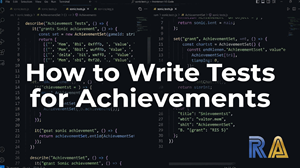
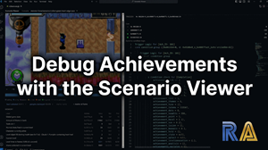

# cruncheevos-playtest

**Test framework** for [cruncheevos](https://github.com/suXinjke/cruncheevos) - record emulator memory as
**test scenarios** and write test for your achievements to check when exactly they should pop (or not)!

**Tutorials (Youtube)**:

[](https://youtu.be/6ZI08izF168 "How to write tests for achievements") [](https://youtu.be/Y2r2bJFaLZ4 "Debug Achievements with the Scenario Viewer")


Features:

* Lua scripts for recording test scenarios (relevant memory + screenshots) in BizHawk
* Test scenario viewer to walk through scenarios and set marker frames (anchors for writing tests)
* JS API for writing tests & validation (based on rcheevos trigger runtime)

Example test:
```js
describe('Finish the first level', () => {
    test('pops exactly when the next level is unlocked at the save screen', () => {
        const s = scenario('level1-finish-regular');
        expect(runAchievement(cheevo, s).triggeredFrame).toBe(s.marker('save-screen'));
    });

    test('does not pop when the level is finished via the skip-level cheat', () => {
        const s = scenario('level1-cheat-level-skip');
        expect(runAchievement(cheevo, s).triggered).toBe(false);
    });
});
```

⚠️ This library is still experimental! Known restrictions:
- Only tested for Game Boy and GBA so far. Let me know if you want to try it for other platforms (especially the Lua recording script needs changes for other platforms).
- Pointers are not supported yet - only static Code notes are recorded so far.

## Getting started

In your personal cruncheevos scripts repo:

```sh
npm install --save-dev cruncheevos-playtest vitest
npx cruncheevos-playtest init my-game
```

This scaffolds a game folder with a recommended layout:

```
my-game/
├── my-game.js             your cruncheevos achievements
├── <gameid>-Notes.json    code notes export (from RAIntegration)
├── recorder-config.lua    per-session recorder settings (name, console, ...)
├── record-scenario.lua    BizHawk recorder (don't edit - updated by init)
├── watchlist.lua          generated - what the recorder captures
├── scenarios/             recordings
└── tests/                 vitest scenario tests
```

### 1. Add & sync code notes

```sh
npx cruncheevos-playtest sync my-game
```

After adding `<gameid>-Notes.json`, run `sync` to generate the `watchlist.lua`, so the BizHawk/Lua knows what addresses
to record.

### 2. Record a Test Scenario with BizHawk

To record a test scenario, edit `recorder-config.lua` to add a `name` (and change `console` if needed), then open
BizHawk and choose Tools > Lua Console, and open `record-scenario.lua`.

**Important**: Make sure `recorder-config.lua` (scenario config), `record-scenario.lua` (recorder script) and
`watchlist.lua` (which addresses to watch, generated from your Code notes) are all in the same place.

Get to the point where you want to start the recording (play through the game, or load a save state), then choose "
Toggle Script" to start, which can take some seconds to initialize.
Play through a relevant part of the game, then stop the script.


Recordings are sparse and cheap (~10 kB/minute): A new row is written only when a watched value changes.
It is better to record generously (with a bit of margin before and after), so the scenarios can be re-used even if
the exact trigger point changes, so they can be used as regression tests.
Screenshots are also recorded, but only used for visual debugging, not for the actual tests themselves.

Output example (saved as `recording.txt`, in the scenario folder):

```csv
frame,0x0770:u8,0x0778:u8,0x077c:u8,0x359c:u16,0x360c:u8
9311,0x0770=15,0x0778=1,0x077c=2,0x360c=0
9312,0x359c=4489
9313,0x359c=4490
9342,0x0770=16,0x0778=0,0x359c=4491,0x360c=8
```

### 3. Set markers in the Scenario Viewer

```sh
npx cruncheevos-playtest viewer
```

Run the above, then open `http://localhost:8123` to open the viewer.


Step through frames with left/right (shift=10 frames, ctrl=60 frames, space=play) and the screenshots & watched addresses will change
according to the recording.

There are per-condition truth dots and hit counts for every frame, which help indicate when a condition is true.

Name the important frames with **markers** ("save-screen", "boss-dead", etc.) when the achievements should pop,
so you can use those in your tests.

### 4. Write tests

This is an example of a test for a progression achievement, which should unlock on reaching the next level, but not if
the player used a cheat.

```js
// monster-force/tests/progression.test.js
import {describe, test, expect} from 'vitest';
import {loadScenario, runAchievement} from 'cruncheevos-playtest/testing';
import set from '../monster-force.js';

const getAchievement = (title) => Object.values(set.achievements).find((a) => a.title === title);
const scenario = (name) => loadScenario(new URL(`../scenarios/${name}`, import.meta.url));

describe('Level 1 progression achievement', () => {
    const cheevo = getAchievement('Welcome to Monsterland');

    test('pops when the next level is unlocked', () => {
        const s = scenario('level1-finish');
        const result = runAchievement(cheevo, s);

        expect(result.triggered).toBe(true);
        expect(result.triggeredFrame).toBe(s.marker('save-screen'));
    });

    test('locks with pause when invincibility cheat is enabled and doesnt pop achievement', () => {
        const s = scenario('level1-finish-cheat-invincibility');
        const result = runAchievement(cheevo, s);

        expect(result.triggered).toBe(false);
        expect(result.stateAt(s.marker('cheat-on'))).toBe('paused');
    });
});
```

The test setup and assertions are plain [vitest](https://vitest.dev/api/describe.html#describe).
Scenarios can be loaded with the `loadScenario` helper, and `runAchievement` will run an achievement through a scenario
so the outcome can be checked against an expectation.

(Like a real emulator, triggers start in the `waiting` state and cannot pop on a recording's first frame.)

`runAchievement(cheevo, scenario)` returns a result with:

* `triggered`
* `triggeredFrame`
* `stateAt(frame)`
* `measuredAt(frame)`
* `framesInState(state)`
* `wasEver(state)`

Scenarios offer:

* `marker(name)`
* `valueAt(frame, address)`
* `slice(fromFrame, toFrame)`

## JS API

```js
import {
    parseTrigger, runTrigger, TriggerRunner, Scenario,
    parseRecording, bytesFromValues
} from 'cruncheevos-playtest';
import {loadScenario, runAchievement, hasScenario} from 'cruncheevos-playtest/testing';
```

The low-level engine works without scenarios or cruncheevos — feed
`parseTrigger('0xH0001=16S...')` any trigger string and drive it with a
`peek(address, numBytes)` function or per-frame byte maps. See
[achievement-trigger-model.md](achievement-trigger-model.md) for the
trigger model itself (groups, flags, hit counts, Delta/Prior).

## Achievement trigger evaluation

The bundled engine is a port of the evaluation core
of [rcheevos](https://github.com/RetroAchievements/rcheevos/tree/develop/src/rcheevos)
(develop branch at 2026-07-23, commit `2ad0b86`), ported to JavaScript by Claude Fable.

The unit test suite from rcheevos and a differential fuzzer (`tools/difftest/`) were used to compare
inputs/outputs per-frame state, measured value and every hit count against the compiled C library on
randomly generated triggers.

## Package layout

```
src/engine/       the rcheevos port
src/              scenario format, discovery, watchlist, test helpers
bin/cli.js        init, viewer, sync
lua/              BizHawk recorder template
scaffold/         files copied into game folders by `init`
viewer/           Scenario viewer (assets + server)
test/             engine + format tests (repo only, not published)
tools/difftest/   fuzzer vs the C library (repo only, not published)
```

## License

MIT
